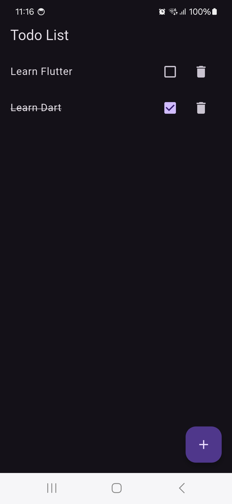
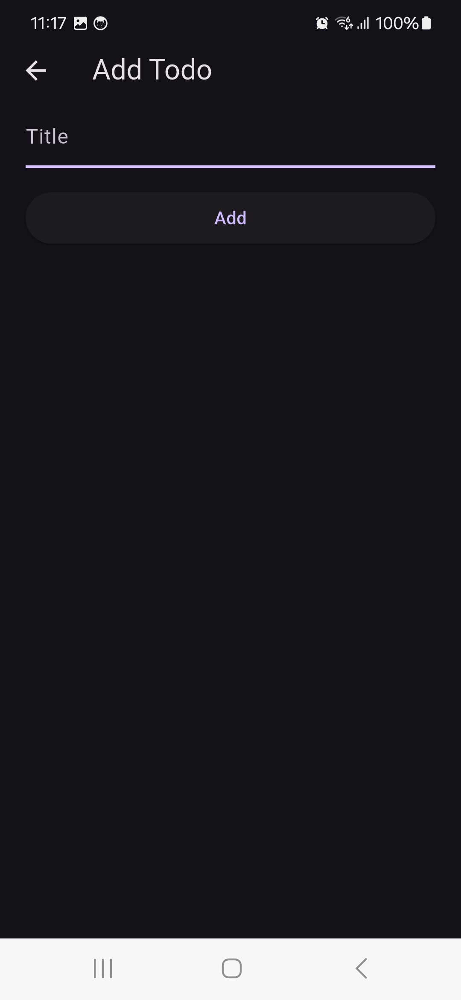

# 📋 To-Do List App

Um simples app de lista de tarefas feito com **Flutter** usando **Provider (ChangeNotifier)** para gerenciar o estado.

## 🖼 Capturas de Tela

### 📜 Lista de Tarefas


### ➕ Adicionar Tarefa


## 🚀 Tecnologias Utilizadas
- Flutter 3.x
- Provider (ChangeNotifier)
- Dart

## ⚙ Como Rodar o Projeto

1. Clone o repositório:
   ```sh
   git clone https://github.com/seu-usuario/todo-list-app.git
